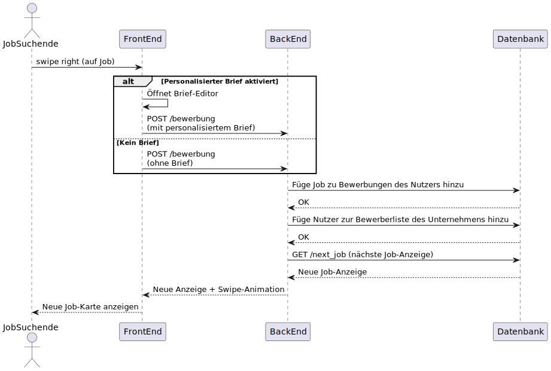
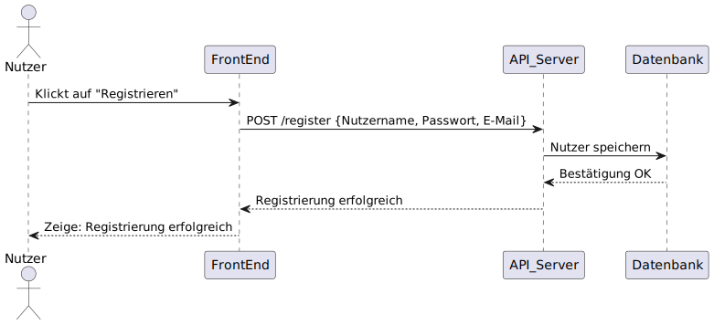
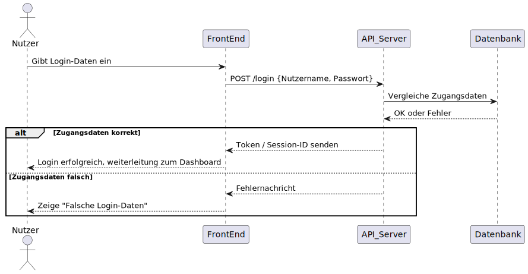

# 📄 JobTinder – Projektdokumentation

Dieses Repository enthält die Projektdokumentation für die JobTinder Webanwendung.

## 📦 Kompilieren der LaTeX-Dokumentation

Die Dokumentation befindet sich im Ordner `docs/` und kann entweder lokal oder automatisch über GitHub Actions kompiliert werden.

### 🔧 Lokale Kompilierung (Voraussetzung: pdflatex oder TeX Live)

```bash
cd docs
pdflatex jobtinder_doku.tex
```

## 🗂️ Diagramme
### Rechts wischen


### Registrieren


### Login


### Bewerbungs Templates

